# ScreenPolish features

Everything below works offline. Where a feature depends on the platform, the
limits section at the end says so. Cards are drawings, not screenshots of the
app.

  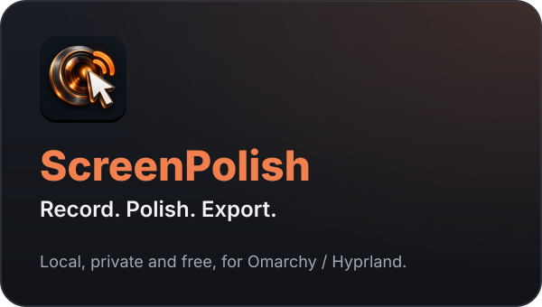
  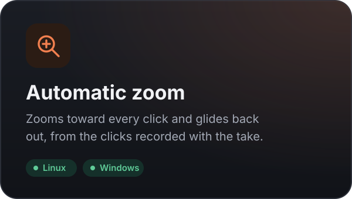

  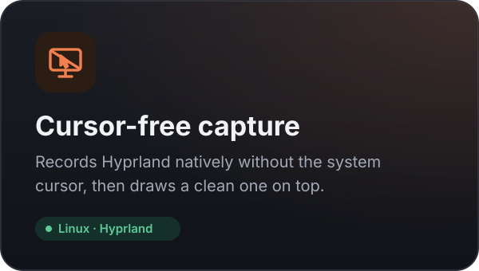
  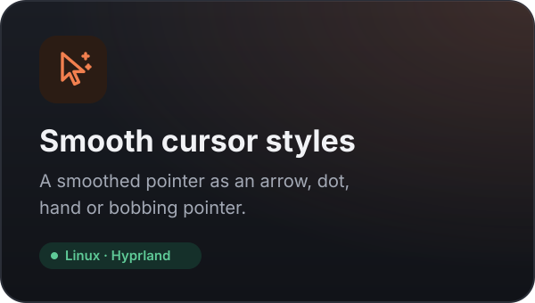

  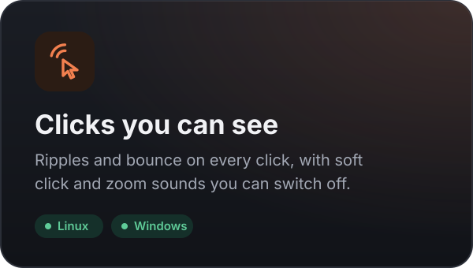
  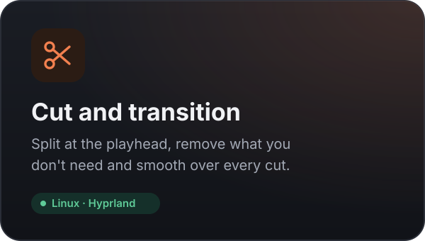

  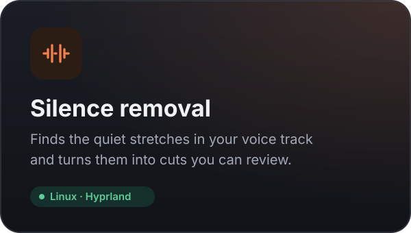
  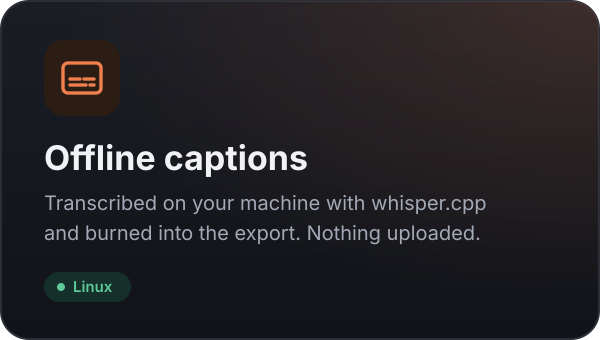

  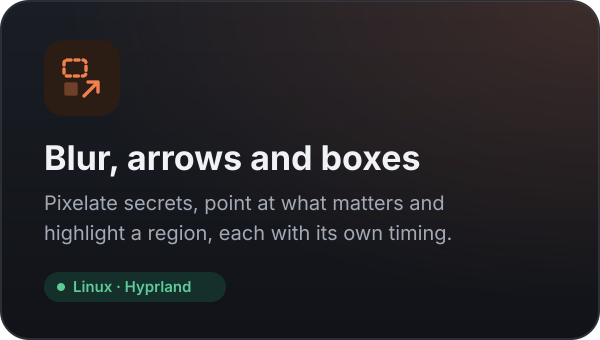
  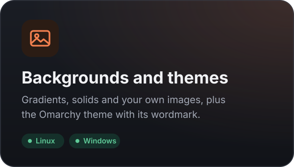

  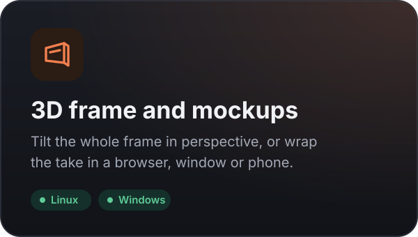
  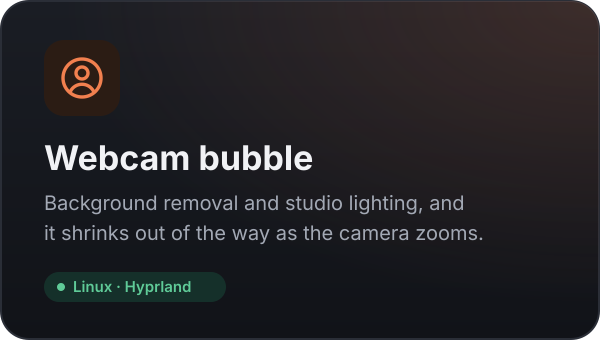

  
  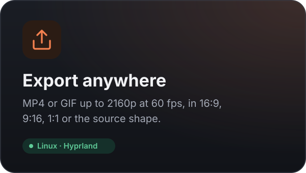

  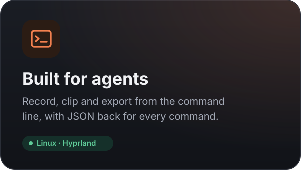

## Capture

| Feature | What you can do |
| --- | --- |
| Screen, window and region | Record a display, an application window or an area you draw |
| Cursor-free native capture | `gpu-screen-recorder` records without the system cursor, so the drawn pointer is the only one |
| Microphone and system audio | Narration and desktop sound, through the PipeWire output monitor |
| Webcam | A camera bubble beside the recording, with background removal |
| 30 or 60 fps | Chosen before the take |
| Keyboard shortcuts | Start, stop and pause without leaving what you are recording |

## Motion and sound

| Feature | What you can do |
| --- | --- |
| Automatic click zoom | Zooms built from the clicks recorded with the take |
| Editable zoom segments | Move, retime or delete any zoom, or add your own |
| Camera styles | Tilt, drift and punch treatments per segment |
| Cursor smoothing and styles | Arrow, dot, hand or bobbing, at any size |
| Click ripples and bounce | Make clicks easy to follow |
| Idle fade | Fade the pointer out while it rests; movement brings it back |
| Soft sounds | Quiet taps on clicks and a whoosh under zooms, both optional |

## Look

| Feature | What you can do |
| --- | --- |
| Backgrounds | Gradients, solid colours and your own images |
| Omarchy theme | The bundled wallpaper, with its wordmark drawn in the margin |
| Frame | Padding, corner radius, shadow, and position within the frame |
| Unified 3D frame | Tilt the whole frame in perspective |
| Mockups | Browser, window and phone shells |
| Overlays | Text, images and stickers, timed or pinned |
| Annotations | Arrows, highlight boxes, and blur or pixelate for anything private |

## Editing and export

| Feature | What you can do |
| --- | --- |
| Trim, split and cut | Shape the timeline, and smooth over each cut with a transition |
| Silence removal | Turn quiet stretches into cuts you can review before applying |
| Speed | 0.25× to 4×, with pitch preserved |
| Crop | Draw the crop on the frame; the export follows it |
| Volume | Microphone, system and master levels, with music and voiceover regions |
| Captions | Transcribed locally with whisper.cpp and burned in at export |
| Undo and redo | Across every edit, with drags batched sensibly |
| MP4 and GIF | Up to 2160p at 60 fps, in 16:9, 9:16, 1:1 or the source shape |

## Library and workflow

- Recordings keep their own folder: sources, `events.json`, `project.json` and exports.
- Sources are never modified; every effect is applied at export.
- Hover a card to preview with the saved effects, and scrub it.
- The recordings folder is a setting.
- `record`, `clip` and `export` from the command line, each answering with JSON.

## What differs by platform

| | Linux (Hyprland) | Windows | macOS |
| --- | --- | --- | --- |
| Capture without the system cursor | yes, native | no | no |
| Drawn pointer replaces the real one | yes | overlay | captured cursor stays |
| Click and pointer log | evdev, mouse only | uiohook | uiohook |
| Offline captions | bundled | not yet | not yet |
| Recording, editing, effects, export | yes | yes | yes |

## Limits worth knowing

- **Cursor-free capture is Hyprland only.** Without `gpu-screen-recorder` the
  desktop portal is used instead, which bakes the system cursor into the video
  and leaves pointer styles with nothing to replace.
- **On Linux, clicks need the `input` group.** Without it there is no click
  data and automatic zoom has nothing to work from; the app says so at the
  start of a take.
- **On Linux keyboards are never opened.** The pointer comes from the
  compositor and buttons from one evdev device. On Windows and macOS input is
  read through uiohook, which sees more than the mouse; only pointer and button
  events are recorded.
- **Captions are English** with the bundled base model, and are bundled on
  Linux only.
- **Encoding is on the CPU** where the GPU encoder is unavailable.
- **Installers are unsigned.** SmartScreen warns on Windows; macOS quarantines
  the app until `xattr -dr com.apple.quarantine` clears it.
